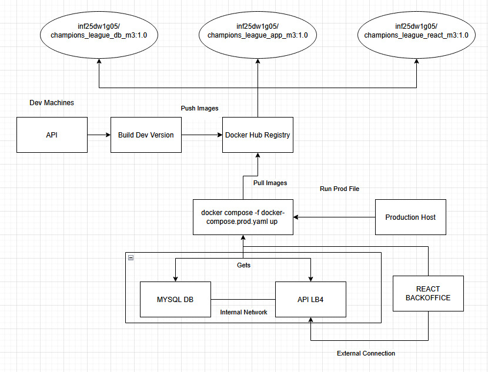

# C3 : Produto

_Descrição do desenvolvimento, instalação e execução do produto_

## 3.1 Desenvolvimento

Neste capítulo explicamos como organizámos e desenvolvemos o nosso projeto **Football Champions League**.

Decidimos separar o projeto em três partes principais para manter a organização e facilitar o desenvolvimento:

1.  **Backend (API)**: Usámos **Node.js** com a framework **LoopBack 4**. A API é responsável por fazer a ligação à base de dados e fornecer os dados ao frontend de forma segura.
2.  **Frontend (Backoffice)**: Criámos a interface usando **React Admin**. Escolhemos esta tecnologia porque facilita muito a criação de tabelas e formulários, permitindo-nos focar mais na lógica do negócio e menos no CSS.
3.  **Base de Dados**: Usámos **MySQL**. É aqui que guardamos toda a informação das equipas, jogos, jogadores e eventos.

O código está dividido em pastas (`api`, `backoffice`, `mysql`) para que cada componente trabalhe de forma independente.



## 3.2 Instalação

Para que seja fácil correr o projeto em qualquer computador, configurámos tudo com Docker.

### Executar o projeto

Basta ter o Docker instalado e correr o seguinte comando na pasta principal:

```bash
docker compose -f docker-compose.prod.yaml up
```

Isto vai fazer tudo automaticamente:
1.  Liga a base de dados e cria as tabelas com os dados iniciais (importa os scripts SQL).
2.  Constrói e arranca a API.
3.  Constrói e arranca o site (Frontend).

Se não for utilizado o Docker, é necessário ir às pastas `src/api` e `src/backoffice` individualmente, fazer `npm install` para instalar as bibliotecas e depois `npm start` em cada uma delas.

## 3.3 Utilização

Quando o terminal mostrar que os serviços estão ativos, o projeto fica acessível pelo browser:

* **Para usar a aplicação (Frontend):** Ir a `http://localhost:3006`.
    * Aí encontra-se o Dashboard com os totais e destaques.
    * No menu lateral é possível navegar para ver e gerir as Equipas, Jogadores, Jogos, etc.
    * É possível criar jogos novos, editar jogadores ou adicionar eventos (golos/cartões).

* **Para testar a API (Explorer):** Ir a `http://127.0.0.1:3000/explorer`.
    * Aqui é possível ver todos os endpoints que o LoopBack gerou e testar os pedidos diretamente sem passar pelo frontend.
    * Também é possível verificar o estado da API em `http://127.0.0.1:3000/ping`.

## 3.4 Detalhes de Implementação

Nesta secção mostramos os objetivos que cumprimos e as funcionalidades extra que decidimos adicionar.

### Objetivos Mínimos
* **CRUD**: Implementámos todas as operações (criar, ler, editar, apagar) para equipas, jogadores e jogos.
* **Relações**: As tabelas estão relacionadas corretamente. Por exemplo, os jogadores estão ligados à sua equipa e os eventos estão ligados ao jogo e ao jogador.

| Recurso Origem | Tipo de Relação | Recurso Destino | Nome da Propriedade |
| :--- | :--- | :--- | :--- |
| Team | HasMany | Player | `players` |
| Team | HasOne | Standings | `standings` |
| Team | HasMany | Match (jogos em casa) | `homeMatches` |
| Team | HasMany | Match (jogos fora) | `awayMatches` |
| Player | BelongsTo | Team | `team` |
| Player | HasOne | Stats | `stats` |
| Player | HasMany | MatchEvent | `matchEvents` |
| Player | HasManyThrough* | Match | `matches` |
| Match | BelongsTo | Team (Equipa da Casa) | `homeTeam` |
| Match | BelongsTo | Team (Equipa Visitante) | `awayTeam` |
| Match | HasMany | MatchEvent | `matchEvents` |
| Match | HasManyThrough* | Player | `players` |
| MatchEvent | BelongsTo | Match | `match` |
| MatchEvent | BelongsTo | Player | `player` |

### Funcionalidades Extra (Valorização)
* **Triggers no MySQL**: Para evitar recalcular a classificação no código sempre que alguém consulta a tabela, criámos *Triggers* na base de dados. Assim, sempre que um jogo termina ou o resultado é alterado, a base de dados atualiza automaticamente os pontos e golos das equipas.
* **Cores e Estilos Dinâmicos**: Personalizámos o React Admin para o site ficar mais apelativo. Por exemplo, nos resultados dos jogos, quem ganha aparece a verde. Também implementámos suporte para *Dark Mode* (modo escuro).
* **Filtros de Pesquisa**: Em vez de escrever os nomes dos grupos ou posições manualmente, colocámos listas de opções (dropdowns) para tornar a pesquisa de jogadores mais rápida e sem erros.

### Uso de IA (Inteligência Artificial)

Usámos ferramentas de IA (Gemini) para nos ajudar com uma tarefa de gerar dados, pois fazer tudo manualmente seria inviável dado o volume de dados:
- Como o objetivo era simular a época 2023/2024 real, pedimos à IA para gerar os scripts SQL com os nomes reais dos jogadores, equipas e resultados dos jogos.

***NOTA**: O uso de IA é relativo ao trabalho (M2) anterior. 

---

[< Previous](c2.md) | [^ Main](../../../) | [Next >](c4.md)
:--- | :---: | ---: